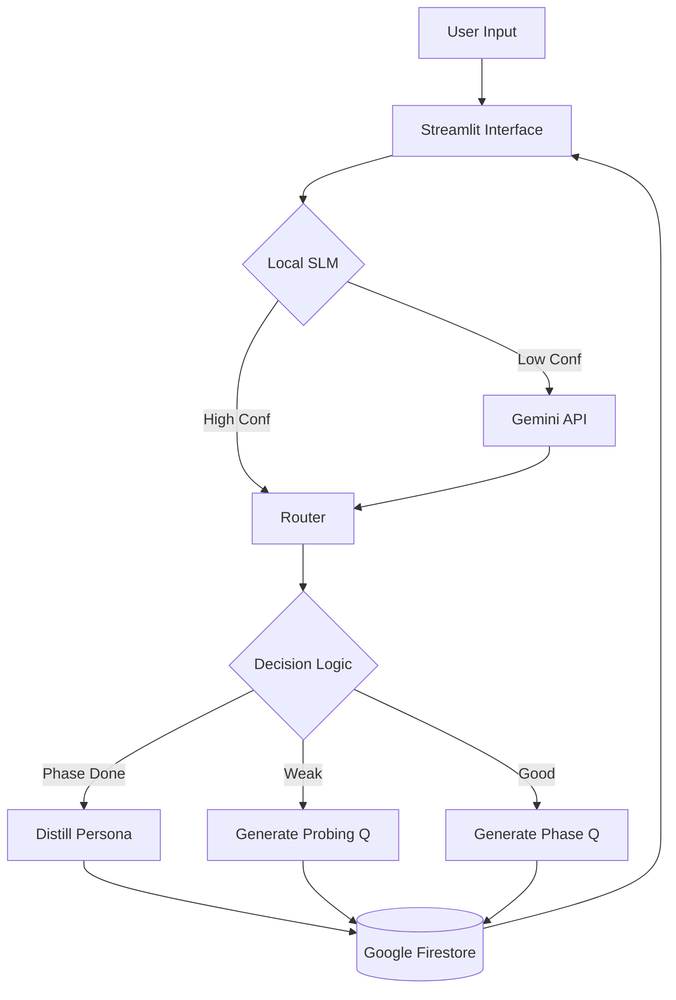

# 🐊 SocraDesign: AI-Powered Socratic Ideation Agent

[](https://opensource.org/licenses/MIT)
[](https://www.python.org/downloads/)
[](https://streamlit.io)
[](https://langchain-ai.github.io/langgraph/)
[](https://huggingface.co/spaces)

**SocraDesign** is an intelligent conversational agent designed to scaffold the creative ideation process. By strictly adhering to the **Double Diamond** design framework (Discover, Define, Develop, Deliver), it uses Socratic questioning to guide users from vague concepts to actionable, prototypable solutions.

Unlike standard chatbots, SocraDesign does not give answers. It asks the right questions to help *you* find them.

---

## 🚀 Key Features (v2.0 Extended)

This system has evolved from a stateless prototype to a robust, persistent application.

* **🧠 Hybrid Evaluation Engine:** Reduces API latency by ~50% using a local Small Language Model (SLM) to classify response quality ("Good", "Weak", "Confused"), falling back to Gemini only when confidence is low.
* **💾 Session Persistence:** Integrated with **Google Firestore** to save conversation history and user personas, allowing users to pause and resume sessions anytime.

* **📱 Mobile Experience:** A completely redesigned, responsive UI with touch-friendly navigation, gamified progress tracking ("Phase Pills"), and auto-scrolling.

* **📊 Live Analytics:** Tracks user engagement metrics (latency, response depth, confusion rate) in real-time for facilitators.

---

## 📂 Project Structure

```text
socra-design/
├── 📁src/
│   └──📄 socradesign_logic.py      # Core LangGraph state machine & Socratic logic
│
├── 📁 ui/
│   └──📄 local_streamlit.py        # Main Streamlit application to run locally (Frontend & UI logic)
│
├── 📁 slm model/                   # Local ML models (SLM)
│    └── 📁 scripts/  
│    │   ├── hybrid_dataset.py      # Data synthesis pipeline (Gemini + Augmentation)
│    │   ├── slm_train.py           # Scikit-learn training script
│    │   └── slm_probe.py           # CLI tool to test models manually                
│    └── 📁 slm_eval/
│    │   ├── slm_evaluation.joblib  # Trained Quality Classifier
│    │   └── slm_tone.joblib        # Trained Tone Classifier
│    └── 📁 data/                   # Datasets for training the SLM
│        ├── seed.csv               # Initial synthetic data from Gemini
│        └── train.csv              # Augmented hybrid training set
│
├── 📁 docs/                        # Archeitcture and Interface Diagrams 
│    ├── Socra UI.png               # Interface
│    └── System Archeitecture.png   # Archeitecture
│
├── 📁 results/                    # Archeitcture and Interface Diagrams 
│    └── 📁 deep eval logs/        # Folder with deep eval logs
│    │   ├── eval logs.log         # deep eval log            
│    └── slm_training_reports.txt  # slm training report
│
├── 📄 requirements.txt            # Python dependencies
├── 📄 .env                        # Environment variables (API keys, config)
└── 📄 README.md                   # Project documentation
```
---

## 📹 Demo & Walkthrough

See SocraDesign in action! This video demonstrates a full session, highlighting the **Hybrid Evaluation** and **Phase Pill** progression.

| Video Access | Description |
| :--- | :--- |
| **YouTube Link** | **[https://www.youtube.com/watch?v=y3ngU1qYQv0&feature=youtu.be]** |

### Scan to see the demostration of the tool
<div align="center">
  
</div>

### Deployment

The final application is hosted on Hugging Face Spaces for immediate access.

| Video Access | Description |
| :--- | :--- |
| **Live Hugging Face Space URL** | [https://huggingface.co/spaces/Shaun121/Socradesign)] |

---

## 🛠️ Setup & Installation

### 1. Prerequisites

* Python 3.10+
* A Google Cloud Project with Firestore enabled.
* A Google Gemini API Key.
  
### 2. Clone repository

```bash
# Clone the Repository
git clone [https://github.com/shaunjose/socra-design.git](https://github.com/shaunjose/socra-design.git)

cd socra-design
```

### 3. Install Dependencies

```bash
python -m venv venv
source venv/bin/activate  # On Windows: venv\Scripts\activate
pip install -r requirements.txt
```

### 4. Configuration

```bash
GEMINI_API_KEY="your_google_api_key_here"
USE_LOCAL_EVAL=1
SLM_CONF_THRESHOLD=0.7
```
### 5.Firestore Setup

* Go to the Firebase Console.
* Create a project and enable Firestore Database.
* Generate a Service Account Private Key (JSON).
* For Local Run: Save the JSON file as service_account.json in your root folder.
* For Cloud/Spaces: Copy the contents of the JSON file into a secret named FIREBASE_SERVICE_ACCOUNT_JSON.

---

## 🏗️ System Architecture

The application follows a client-server architecture using **Streamlit** (Frontend) and **LangGraph** (Backend).



---

## Usage

Option A: Run the Application

```bash
# Launch the Streamlit interface
streamlit run app.py
```

Option B: Re-train the SLM (Optional)
If you want to retrain the local evaluation model on new data:

```bash
# 1. Generate synthetic training data
python hybrid_dataset.py --api-key "YOUR_KEY" --seed-out data/seed.csv --final-out data/train.csv

# 2. Train the scikit-learn pipeline
python slm_train.py --data-path data/train.csv --out-dir models/slm_eval
```
---

## Performance Results
The introduction of the Hybrid Evaluation node and Persistence layer significantly improved robustness.

| Metric | V1(baseline) | V2 | Improvement |
|-------|-------|-------------|----------------------|
| Avg. Turn Latency | ~3.5 sec | ~1.8 sec | 48% Faster |
| Session Continuity | 0% (Stateless) | 100% (Firestore) | Persistent |
| Mobile Support | Broken | Native-like | Full Support |

---

## Known Issues & Limitations

1. Cold Start: The first question in a new session may take 2-3 seconds longer as the LangGraph compiles and connects to Firestore.

2. Firestore Limits: The current implementation uses the free tier of Firebase. Extremely high traffic (>50k writes/day) may hit quota limits.=

3. LLM Hallucinations: While the Socratic prompts are strict, the underlying LLM (Gemini) may occasionally suggest a solution instead of asking a question. The "Self-Correction" loop catches 90% of these cases.

---

## Responsible AI & Privacy

* Data Handling: User inputs are stored in Google Firestore and processed by Google Gemini. This is explicitly stated in the app's sidebar.

* Bias Mitigation: The "Develop" phase prompt has been engineered to encourage diverse, non-technical solutions to prevent tech-solutionism bias.

* User Agency: The final report is generated based only on user inputs. The AI acts as a facilitator, not an author.

---

## Contact

Shaun Noel Jose (Masters in Applied Data Science)

Student at University of Florida

Built with 🧡 at the University of Florida.

